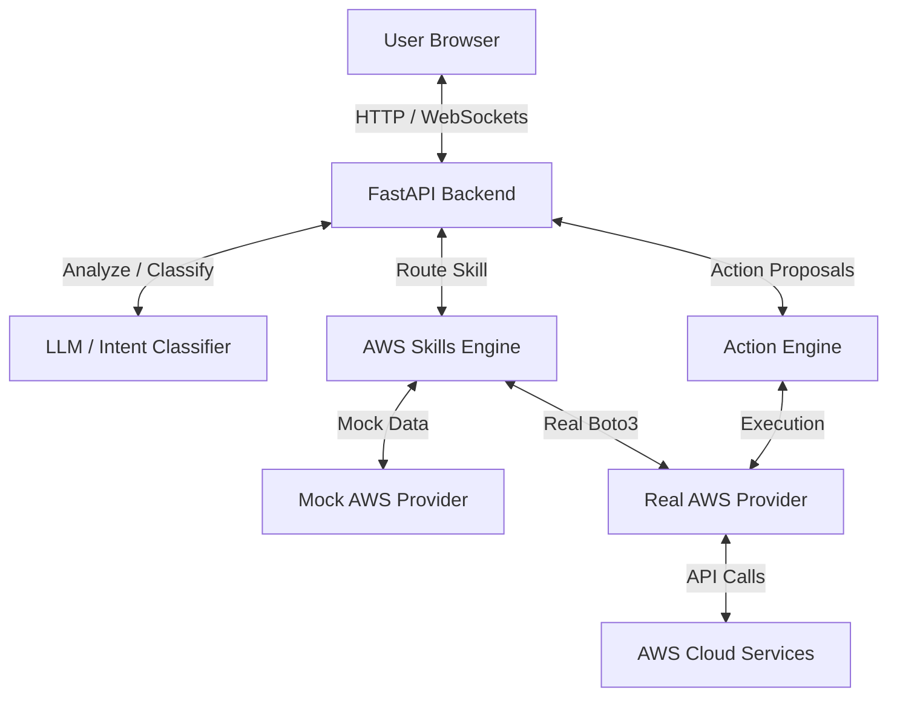
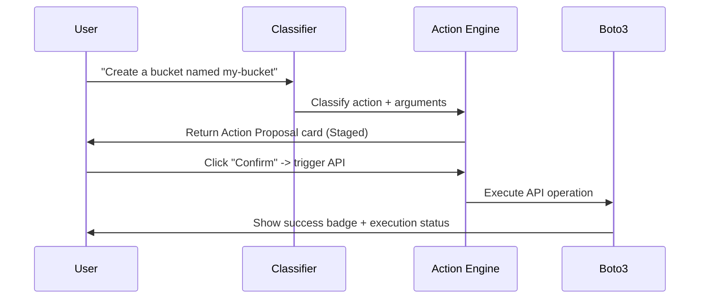

# AWS NLP Assistant - Technical Documentation

This document provides a comprehensive technical overview of the **AWS NLP Assistant**, detailing its system architecture, backend NLP pipeline, action confirmation flow, AWS credentials integration, and custom frontend components.

---

## 1. System Architecture

The AWS NLP Assistant is built using a modern decoupled architecture:



*   **Frontend**: Built with **React**, **Vite**, and **TailwindCSS**. Visual enhancements include custom HTML5 Canvas **Chart.js** charting, **particles.js** backgrounds, and custom layouts for resource tables/cards.
*   **Backend**: Built with **FastAPI** (Python), using **boto3** to interface with AWS services, and utilizing structured NLP processing to classify intents and normalize resource data.

---

## 2. Backend Pipeline

### A. Intent Classification
Located in [`backend/intent_classifier.py`](file:///c:/Users/Atharva/OneDrive/Desktop/aws-nlp-assistant/backend/intent_classifier.py), the NLP classifier uses conversational history routing to parse user input and identify:
1.  **Skills (Read operations)**: System health, cloud costs, error logs, configuration changes, S3 status, RDS status, and cost optimization opportunities.
2.  **Actions (Write operations)**: Instance lifecycle management (stop, restart), Auto Scaling Group capacity changes, S3 bucket creation, and RDS snapshots.

### B. AWS Skills Engine
Located in [`backend/aws_skills.py`](file:///c:/Users/Atharva/OneDrive/Desktop/aws-nlp-assistant/backend/aws_skills.py), this engine serves as the orchestrator:
*   Fetches raw metrics and data from either mock data files or live AWS services.
*   Normalizes the raw data for charts (e.g. mapping service spending or instance CPU utilization into coordinate points).
*   Translates the results into user-friendly summary responses.

---

## 3. Real vs. Mock Providers

The assistant supports a seamless toggle via the `AWS_MOCK` variable in `backend/.env`.

### Mock Provider (`backend/mock_aws.py`)
Utilizes JSON-based configurations stored under `/mock-data` to emulate real AWS API behaviors. This allows local development without incurring AWS charges or requiring internet access.

### Real Provider (`backend/real_aws.py`)
Interfaces directly with AWS endpoints using `boto3`. Features include:
*   **EC2 Management**: Retrieves status metrics and details.
*   **S3 Auditing**: Scans bucket regions and reviews public access blocks.
*   **RDS Monitoring**: Reviews instance classes, DB engines, and database connectivity states.
*   **Cost Explorer**: Scans cost metrics grouped by services, dynamically pushing target ranges to avoid same-day query failures.
*   **Cost Optimization**: Scans for unattached EBS volumes and stopped EC2 instances to estimate monthly savings.

---

## 4. Action Engine & Confirmation Flow

To prevent accidental modifications, all write operations require two-stage confirmation:



*   **Proposal Stage**: The Action Engine (`backend/action_engine.py`) returns a structured action card showing precisely what will happen (e.g., target AMI, instance type, snapshot name, capacity changes).
*   **Execution Stage**: Once the user clicks "Confirm" on the frontend, a write API call is dispatched to run the boto3 function. Secure defaults are hardcoded (e.g., S3 buckets are created with default server-side encryption and block public access turned ON).

---

## 5. Frontend & UI Visuals

### Typography
The application uses the Google Fonts **Instrument Sans** typeface, providing a premium, modern developer-dashboard appearance. Defined globally in:
*   [`index.html`](file:///c:/Users/Atharva/OneDrive/Desktop/aws-nlp-assistant/frontend/index.html)
*   [`tailwind.config.js`](file:///c:/Users/Atharva/OneDrive/Desktop/aws-nlp-assistant/frontend/tailwind.config.js)

### Background Particles
Powered by **particles.js**, the chat background features a floating, dark-themed node network. It initializes dynamically upon checking for script resolution in `ChatPage.jsx`, adjusting to screen resolution.

### Data Visualizations (Chart.js)
The [`MiniChart.jsx`](file:///c:/Users/Atharva/OneDrive/Desktop/aws-nlp-assistant/frontend/src/components/MiniChart.jsx) component uses `react-chartjs-2` to display canvas-based line and bar charts:
*   **Line charts**: Display CPU metrics.
*   **Bar charts**: Display cost-by-service spending structures.
*   **Color schemes**: Themed in neon-cyan (`#00d9ff`) with custom dark grids and tooltips.

---

## 6. Local Setup & Configuration

### A. Environment Configuration (`backend/.env`)
Ensure your environment contains the following keys for authentication:
```ini
AWS_ACCESS_KEY_ID=your_access_key
AWS_SECRET_ACCESS_KEY=your_secret_key
AWS_REGION=ap-south-1
AWS_MOCK=false # Set to true to use mock data providers
```

### B. Required IAM User Permissions
Attach the following policy to your AWS IAM user to support all queries and operations:
```json
{
    "Version": "2012-10-17",
    "Statement": [
        {
            "Sid": "AWSNLPAssistantPermissions",
            "Effect": "Allow",
            "Action": [
                "ec2:DescribeInstances",
                "ec2:DescribeVolumes",
                "ec2:StartInstances",
                "ec2:StopInstances",
                "ec2:RunInstances",
                "ssm:GetParameter",
                "ce:GetCostAndUsage",
                "s3:ListAllMyBuckets",
                "s3:GetBucketLocation",
                "s3:GetBucketPolicyStatus",
                "s3:GetBucketAcl",
                "s3:CreateBucket",
                "s3:PutBucketPublicAccessBlock",
                "s3:PutEncryptionConfiguration",
                "rds:DescribeDBInstances",
                "rds:CreateDBSnapshot",
                "autoscaling:DescribeAutoScalingGroups",
                "autoscaling:UpdateAutoScalingGroup"
            ],
            "Resource": "*"
        }
    ]
}
```
